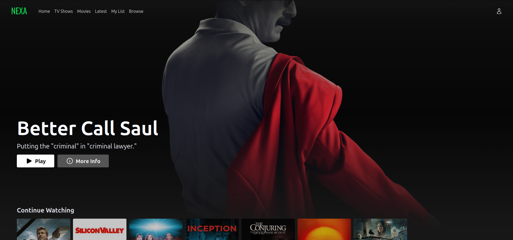

# Nexa

Cloud-native video streaming platform built on AWS with edge-first delivery.

<p align="center">
  
</p>

Nexa is a cloud-native video streaming platform built on AWS, designed to deliver scalable, fault-tolerant playback and low-latency content delivery using an edge-first architecture. It provides a browsable movie and TV catalog, full-text search, user watchlists, authenticated HLS playback, and server-side rendered pages — all delivered through a single CloudFront entry point.

---

## Architecture Overview

```
Browser
  │
  ├─► CloudFront Edge  (nexa.zdelar.com)
  │     ├── default /*          ──► Lambda (SSR with failover)
  │     ├── /_nuxt/*, /icons/*  ──► S3 Frontend Assets
  │     ├── /api/*              ──► ALB ──► ECS Fargate (microservices)
  │     └── /playback/*         ──► API Gateway V2 ──► Lambda (HLS playlist and subtitle handlers)
  │
  └─► CloudFront CDN  (cdn.nexa.zdelar.com)
        └── signed cookies ──► S3 (content-public, content-protected, video-processed)
```

---

## Features

- Server-side rendered frontend with edge delivery
- Secure, token-based HLS playback using signed cookies
- Edge-delivered video content via dedicated CDN
- Full-text search powered by OpenSearch
- Scalable microservices running on ECS Fargate

---

## Technology Stack

| Layer          | Technologies                                                                                                                                          |
| -------------- | ----------------------------------------------------------------------------------------------------------------------------------------------------- |
| Frontend       | Nuxt 3, Vue 3, Pinia, TailwindCSS, AWS Amplify, hls.js                                                                                                |
| Backend        | Java, Spring Boot, AWS SDK v2, MapStruct, Lombok                                                                                                      |
| Infrastructure | Terraform, AWS (CloudFront, WAF, ALB, ECR, ECS Fargate, API Gateway, Lambda, DynamoDB, OpenSearch, S3, MediaConvert, Cognito, SES, SSM, Route53, ACM) |
